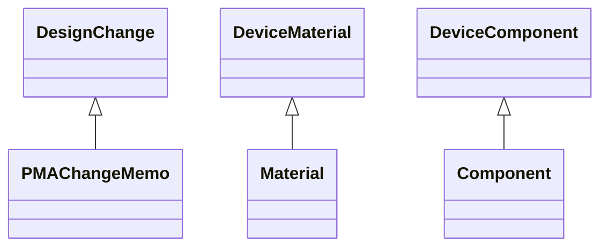
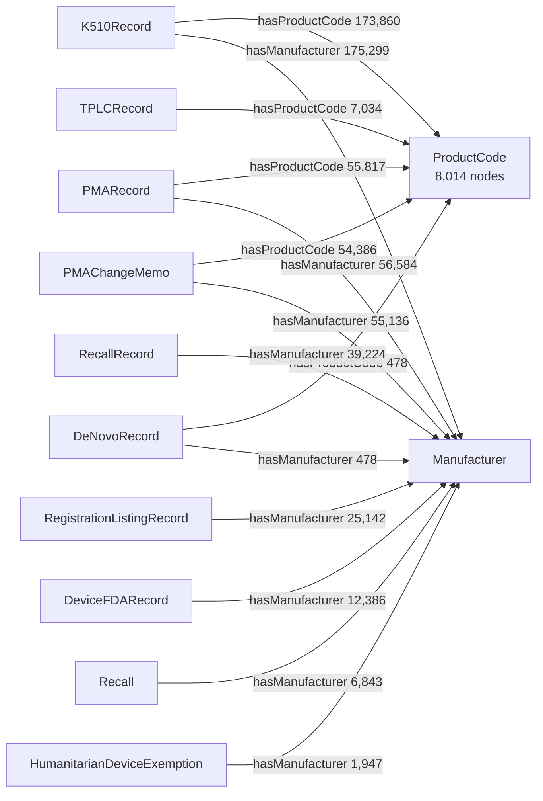
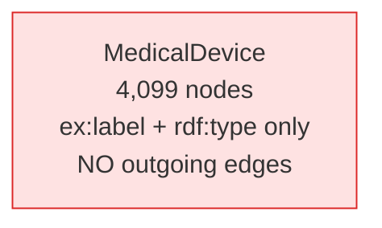
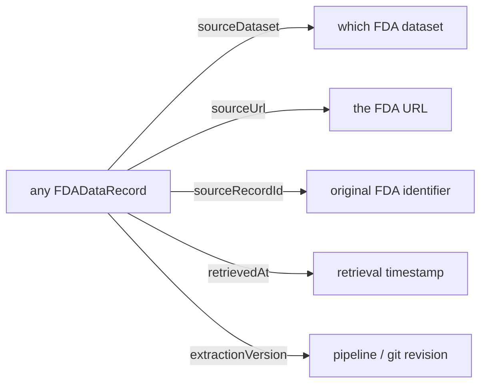

# Schema diagrams

Generated from `ontology/ontology.ttl`, 2026-09-07. Closes the schema-diagram
recommendation in the Proto-OKN graph construction guidelines.

The ontology declares **50 classes**; **29** currently carry instances. The gap is
declared-but-unused vocabulary, not missing data.

Namespace on these diagrams is `ex:` = `http://medicaldevice.com/ontology/`, which becomes
`https://bmedesign.org/medical-device-kg/ns/` after the September 2026 migration.

---

## 1. Class hierarchy — the record spine

This is the part worth showing at review. `rdfs:subClassOf` is genuinely populated: every
FDA dataset class hangs off an abstract parent rather than floating free.

```mermaid
classDiagram
    class FDADataRecord["FDADataRecord"]
    class RegulatorySubmission["RegulatorySubmission"]
    class AdverseEventReport["AdverseEventReport"]
    class SafetyReport["SafetyReport"]

    FDADataRecord <|-- RegulatorySubmission
    FDADataRecord <|-- AdverseEventReport
    AdverseEventReport <|-- SafetyReport

    RegulatorySubmission <|-- K510Record
    RegulatorySubmission <|-- PMARecord
    RegulatorySubmission <|-- DeNovoRecord
    RegulatorySubmission <|-- HDERecord

    AdverseEventReport <|-- MAUDEReport
    AdverseEventReport <|-- MedSunReport

    FDADataRecord <|-- TPLCRecord
    FDADataRecord <|-- AccessGUDIDRecord
    FDADataRecord <|-- RecallRecord
    FDADataRecord <|-- ProductClassificationRecord
    FDADataRecord <|-- RegistrationListingRecord
    FDADataRecord <|-- DeviceListing
    FDADataRecord <|-- DevicesFDARecord

    FDADataRecord <|-- CLIARecord
    FDADataRecord <|-- CLIAWaivedRecord
    FDADataRecord <|-- IVDRecord
    FDADataRecord <|-- MammographyFacility
    FDADataRecord <|-- RecognizedStandard
    FDADataRecord <|-- Postmarket522Study
    FDADataRecord <|-- XRayAssemblerRecord
```



Reading it: **premarket review** on the left branch (510(k), PMA, De Novo, HDE),
**postmarket safety** in the middle (MAUDE, MedSun), and everything else — classification,
recalls, establishments, laboratory, facilities — attached directly to `FDADataRecord`.

---

## 2. Other hierarchies



---

## 3. Core entity relationships — as actually instantiated

> **Read this section before the previous one is used to explain the graph.** The ontology
> declares a device-centric model in which every record hangs off `MedicalDevice`. Verified
> against the live endpoint on 2026-09-07, **that model is not instantiated.** `MedicalDevice`
> nodes carry only `ex:label` and `rdf:type` — 4,099 of them, with zero outgoing edges.
>
> The diagram below shows what the data actually contains. See audit §4A.

Records link **directly** to the shared entities. `ProductCode` and `Manufacturer` are the
real join hubs — which is exactly how FDA itself relates these systems.



**The cross-dataset questions are answerable** — join on product code, exactly as a regulatory
analyst would. What is *not* available is a device-level entity to hang a narrative on.

### The isolated class



Two ways to reconcile this, and it is a design decision rather than a defect to patch:

1. **Document the real model** — make `ProductCode` the declared hub and remove the
   uninstantiated `has*Record` properties. Honest, cheap, and matches FDA's own structure.
2. **Instantiate the declared model** — populate device links in the pipeline. Faithful to
   the original design, much more work, and arguably redundant.

Option 1 is the better answer. FDA's product code *is* the device concept for regulatory
purposes.

---

## 4. Provenance

Every record carries these, which is what makes any result traceable to source.



---

## Known modelling issues

Carried from the data-quality audit, listed here so the diagrams are not read as a clean
bill of health:

- **`Recall` and `RecallRecord` both exist** and are not linked. `Recall` (6.8K) hangs off
  `TPLCRecord` via `hasRecall`; `RecallRecord` (39.2K) subclasses `FDADataRecord`. Either
  relate them explicitly or consolidate.
- **`ProductCode` nodes carry no `rdfs:label`** — only the three-letter code. They are the
  hub of the graph and currently unreadable to a human.
- **21 classes and 106 properties are declared but unused.** Prune or document.
- **No `owl:sameAs` / `skos:exactMatch`** to external vocabularies. NCIt is the strongest
  candidate: NIH-sponsored, native OWL, free, and has a device branch.

## Regenerating

`mcp-okn` will produce a diagram directly from the deployed graph:

```
visualize_schema("medical-device-kg")
```

Worth comparing its output against these, since it reflects what is *in the data* while
these reflect what the *ontology declares* — and we know those two differ by 21 classes.
